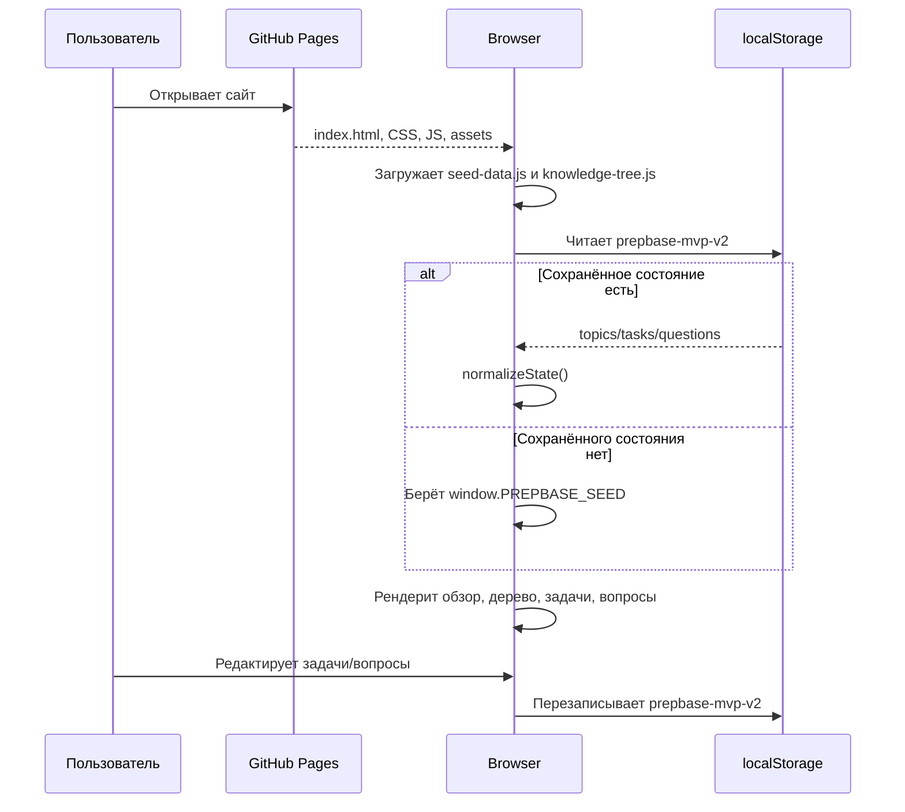
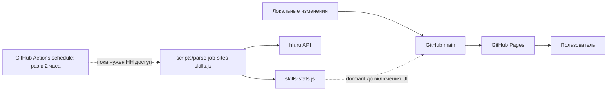
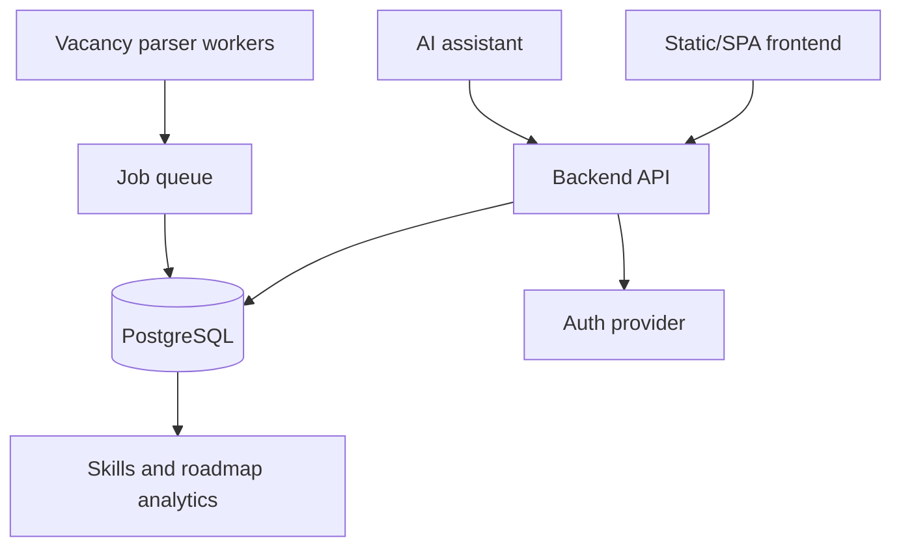

# Архитектура SA HALPER

SA HALPER сейчас устроен как статическое frontend-приложение. Вся логика работает в браузере, данные поставляются через JS-файлы, пользовательские изменения сохраняются локально в браузере. Серверной части и централизованной БД пока нет.

## Контекст

```mermaid
flowchart LR
  user[Пользователь<br/>Системный или бизнес-аналитик]
  sa[SA HALPER<br/>Статический frontend]
  pages[GitHub Pages<br/>Хостинг статических файлов]
  storage[(Browser localStorage<br/>Локальное состояние)]
  actions[GitHub Actions<br/>Плановый парсер HH]
  hh[hh.ru API<br/>Источник вакансий]

  user -->|Открывает сайт| pages
  pages -->|HTML/CSS/JS/assets| sa
  user -->|Работает с базой знаний| sa
  sa -->|Читает и пишет| storage
  actions -. Запрашивает вакансии .-> hh
  actions -. Обновляет skills-stats.js .-> pages
```

## Runtime В Браузере

```mermaid
flowchart TB
  index[index.html] --> css[styles.css / serious-theme.css / premium-hero.css]
  index --> app[app.js]
  index --> shell[site-shell.js]
  index --> knowledgeUi[knowledge-ui.js]
  index --> seed[seed-data.js]
  index --> tree[knowledge-tree.js]
  index --> extra[questions-extra.js]

  seed --> app
  extra --> app
  tree --> knowledgeUi
  app --> storage[(localStorage prepbase-mvp-v2)]
  knowledgeUi --> orderStorage[(localStorage prepbase-knowledge-order-v1)]
  shell --> navigation[Навигация и mobile menu]

  parserFiles[skills-stats.js / skills-stats-ui.js / skills-stats.css]
  parserFiles -. dormant: не подключены к текущему index.html .-> futureDashboard[Будущий блок вакансийной аналитики]
```

## Фронтенд-Модули

| Файл | Ответственность |
| --- | --- |
| `index.html` | Разметка приложения, подключение CSS/JS, основные view: обзор, база знаний, задачи, вопросы |
| `premium-hero.css` | Sticky header, бренд, логотип, shell-стили верхнего уровня |
| `styles.css` | Базовая визуальная система приложения |
| `serious-theme.css` | Более строгая тема поверх базовых стилей |
| `site-shell.js` | Mobile menu, smooth scroll, переключение вкладок из header/overview |
| `app.js` | Основное состояние: темы, задачи, вопросы, формы, фильтры, сохранение в `localStorage` |
| `knowledge-ui.js` | Рендер дерева знаний, сворачивание веток, поиск, перемещение корневых блоков |
| `knowledge-tree.js` | Статическая база знаний и источники |
| `seed-data.js` | Начальное состояние тем, задач и вопросов |
| `questions-extra.js` | Миграция/добавление дополнительных вопросов в seed и существующее состояние |
| `skills-stats.js` | Статический payload вакансийной аналитики, сейчас не подключён к `index.html` |
| `skills-stats-ui.js` | UI навыков и компаний, сейчас не подключён к `index.html` |
| `skills-stats.css` | Стили вакансийной аналитики, сейчас не подключены к `index.html` |
| `scripts/parse-job-sites-skills.js` | Парсер hh.ru API, формирует `skills-stats.js` |

## Поток Загрузки



## Deployment И Парсер



Важно: вакансийная аналитика архитектурно подготовлена, но до получения токена HH этот контур нельзя считать рабочим продуктовым источником данных. В текущем UI соответствующие файлы не подключены к `index.html`.

## Текущие Ограничения

- Нет авторизации и общего облачного состояния.
- `localStorage` привязан к конкретному браузеру и домену.
- Нет серверной валидации пользовательских данных.
- Данные базы знаний обновляются через код, а не через административный интерфейс.
- Парсер HH зависит от доступа к API и секретов GitHub Actions.

## Целевое Расширение



Следующий естественный шаг масштабирования - вынести `topics`, `tasks`, `questions`, `knowledge nodes` и `skill stats` из JS/localStorage в API и PostgreSQL, сохранив текущие frontend-компоненты как клиентский слой.
