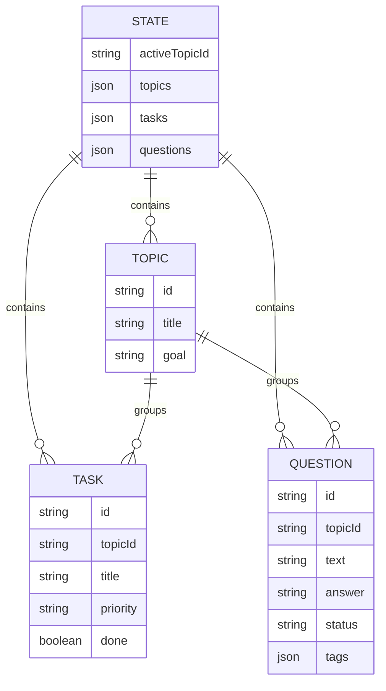
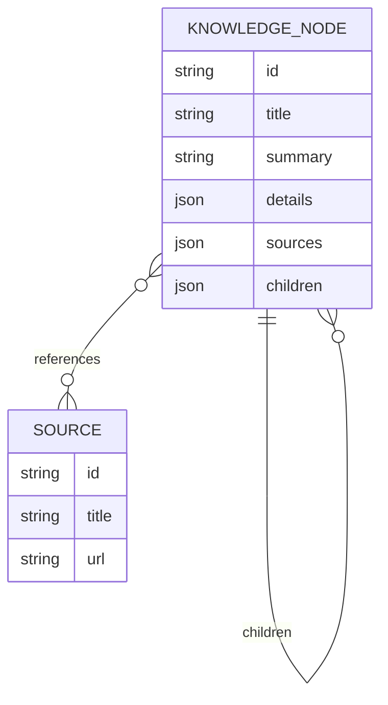
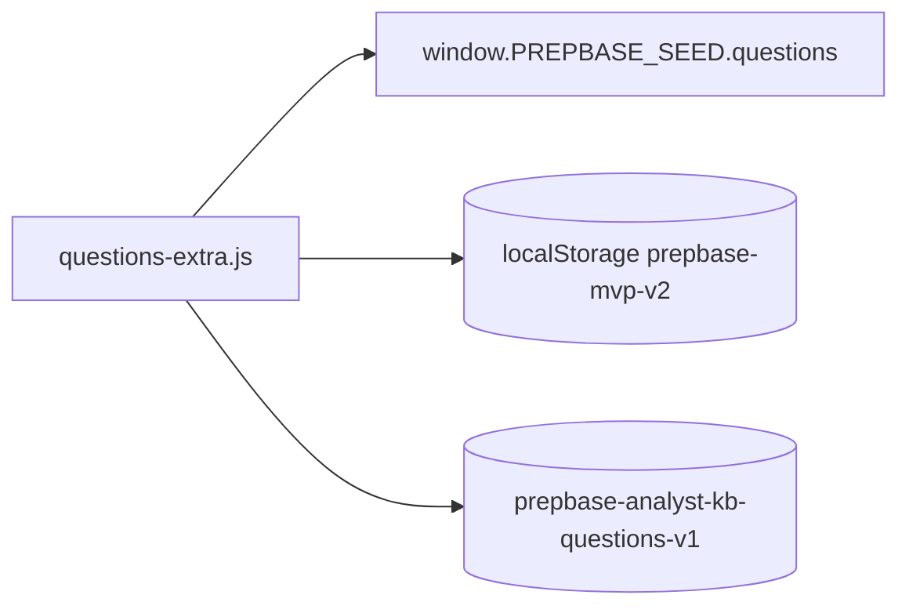
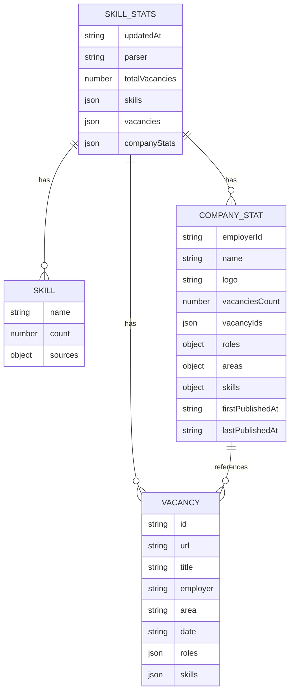

# Модель Данных

В текущем MVP нет серверной БД. Роль "базы" выполняют:

- `localStorage` - пользовательское состояние в браузере;
- JS seed-файлы - поставка справочников и начальных данных;
- `skills-stats.js` - статический аналитический payload, который должен обновляться парсером.

## Хранилища

| Хранилище | Ключ / файл | Назначение | Кто пишет |
| --- | --- | --- | --- |
| `localStorage` | `prepbase-mvp-v2` | Активная тема, темы, задачи, вопросы | `app.js` |
| `localStorage` | `prepbase-knowledge-order-v1` | Порядок корневых блоков базы знаний | `knowledge-ui.js` |
| `localStorage` | `prepbase-analyst-kb-questions-v1` | Флаг миграции дополнительных вопросов | `questions-extra.js` |
| JS global | `window.PREPBASE_SEED` | Начальные темы, задачи, вопросы | `seed-data.js` |
| JS global | `window.PREPBASE_KNOWLEDGE_TREE` | Иерархия базы знаний | `knowledge-tree.js` |
| JS global | `window.PREPBASE_KNOWLEDGE_SOURCES` | Источники для дерева знаний | `knowledge-tree.js` |
| JS global | `window.PREPBASE_SKILL_STATS` | Навыки, вакансии, компании; сейчас не загружается текущим `index.html` | `skills-stats.js` |

## Основное Состояние



### `prepbase-mvp-v2`

```json
{
  "activeTopicId": "all",
  "topics": [
    {
      "id": "integrations",
      "title": "Интеграции",
      "goal": "Понимать способы обмена данными между системами"
    }
  ],
  "tasks": [
    {
      "id": "task-1",
      "topicId": "integrations",
      "title": "Разобрать REST и HTTP методы",
      "priority": "Средний",
      "done": false
    }
  ],
  "questions": [
    {
      "id": "question-1",
      "topicId": "integrations",
      "text": "Чем REST отличается от SOAP?",
      "answer": "Краткий ответ или тезисы",
      "status": "Учу",
      "tags": ["API", "REST", "SOAP"]
    }
  ]
}
```

`app.js` нормализует состояние при загрузке: отбрасывает некорректные записи, создаёт fallback из `seed-data.js`, проверяет связи с темами.

## База Знаний



Пример уровня дерева:

```text
Интеграции
  API
    REST
    SOAP
    GraphQL
  Асинхронный обмен
    Kafka
    RabbitMQ
```

Особенности текущей реализации:

- ветки второго и третьего уровня по умолчанию свёрнуты;
- текст можно скрывать глобально;
- корневые блоки можно двигать выше/ниже;
- порядок корневых блоков хранится отдельно в `prepbase-knowledge-order-v1`;
- содержимое дерева редактируется через `knowledge-tree.js`, а не через UI.

## Вопросы

Дополнительные вопросы из analyst-kb добавляются через `questions-extra.js`.



Миграция устроена так, чтобы не дублировать вопросы по `id`.

## Вакансийная Аналитика

`skills-stats.js` должен содержать `window.PREPBASE_SKILL_STATS`.



Сейчас этот контур считается подготовленным, но не основным, потому что стабильная работа зависит от HH-токена. Текущий `index.html` не подключает `skills-stats.js` и `skills-stats-ui.js`.

## Что Нужно Учитывать При Переезде В Настоящую БД

- `topics`, `tasks`, `questions` нужно привязать к пользователю.
- `knowledge-tree` лучше разложить в таблицу adjacency list: `id`, `parent_id`, `sort_order`, `title`, `summary`, `details`.
- `sources` стоит вынести отдельно и связать many-to-many с узлами знаний.
- `skills`, `vacancies`, `companies` лучше разделить на нормализованные таблицы.
- `localStorage` можно оставить как offline cache, но источником истины должен стать backend.
